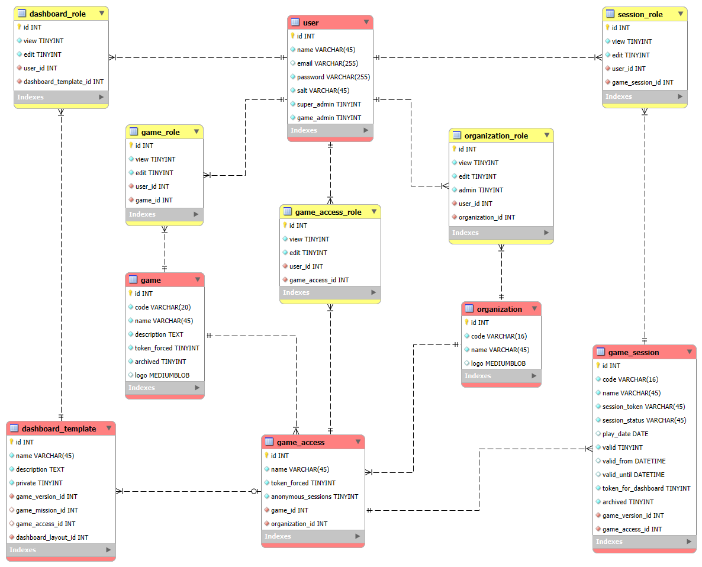

# Database access and roles

Access has been defined through roles. Each user can have multiple roles, defined in five role tables and one attribute within user:

The following rights exist:
- `user.super_admin`: complete rights; defined in the `user` table. See [role super-admin](role_super_admin.md)
- `user.game_admin`: maximum rights as a game admin. See [role game-admin](role_game_admin.md)
- `organization_role.admin`: maximum rights as an organizational user. See [role organization-admin](role_organization.md#admin)
- `organization_role.edit`: editing rights to dashboard templates and game sessions; no user/role rights. See [role organization-edit](role_organization.md#edit)
- `organization_role.view`: only viewing rights as an organizational user. See [role organization-view](role_organization.md#view)
- `game_role.edit`: editing rights to existing games; no user/role rights. See [role game-edit](role_game.md)
- `game_role.view`: only viewing rights for a game as a game user. See [role game-view](role_game.md)
- `game_access_role.edit`: editing rights per single game for an organization; no user/role rights. See [role game-access-edit](role_game_access.md)
- `game_access_role.view`: only viewing rights for a single game for an organization. See [role game-access-view](role_game_access.md)

