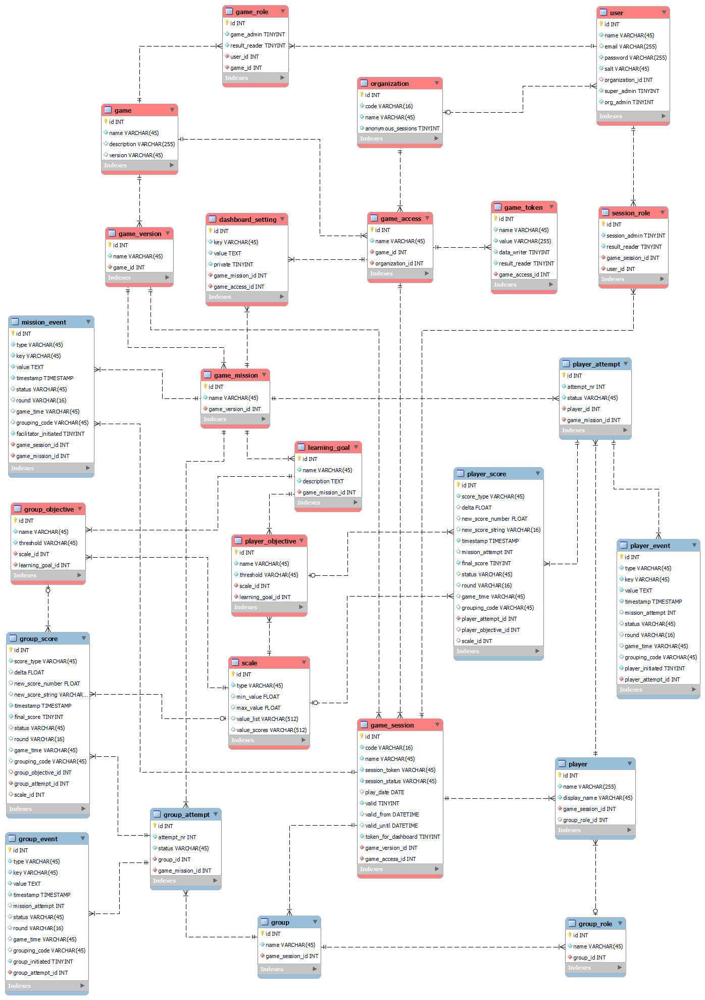

# gamedata database

## Technical details

The gamedata database is implemented in mysql / mariadb as a relational SQL database. The database is typically hosted on the same server as the web environment for the gamedata platform, ensuring that the data does not have to be transferred over a network link. The database schema is called `gamedata` and it needs one user called `gamedata` to access the tables for reading and writing.

The database design looks as follows:

## Tables

The database has the following administrative tables that can be edited through the `gamedata-admin` web application:

* `User`: users can login to the platform to do administration, define game sessions, obtain scores on game play, and retrieve data. Users can be a super_admin, meaning that they can add and change organizations and games, an organization_admin, which means that they can add users and sessions for their organization.
* `Organization`: A `User` can belong to an `Organization`, and an `Organization` can have access to one or more instances of `Game` via the `GameAccess` table.
* `Game`: a game is an on-line playable application. It can be a SCORM file, a Web hosted game, a mobile game, or otherwise. The gamedata platform does not host the games -- this is done on a server or via a LMS.
* `GameAccess`: this defines the access for an `Organization` to a `Game`. 
* `AccessToken`: An organization can have read access and/or write access to the game through a token. Multiple tokens can be defined. A token is a string that replaces a username/password to upload data into the gamedata platform. Tokens can be deleted, after which they cannot be used anymore to provide data to the platform. Tokens prevent the open sending of usernames and passwords over the network, and are much more fine-grained than the users for the platform.
* `GameRole`: A role that a `User` can play for a `Game`, e.g., maintaining the `Game` or having permission to look at the scores for that `Game`. Maintaining the game as a game_admin means that users can add sessions for their game and define dashboards.
* `GameVersion`: A version of a `Game`. A version can indicate a `Game` in another language, a `Game` with other features, or sometimes a `Game` deployed for another `Organization`, e.g., using branding.
* `DashboardSettings`: These belong to a `Game_Mission` and a `GameAccess`, indicating that the organization has access to the game. They define ways in which the game results are shown on dashboards for that organization. Different dashboards can be defined for different game missions. 
* `GameMission`: Missions are separate parts of a `GameVersion` that can be finished, and for which an 'end score' can be calculated. In some cases, rounds of a game are missions, in other cases, rounds do not have separate scores that are to be shown on a leaderboard. When defining a game, administrators do not have restrictions in defining one or several missions for a game. A mission serves as a 'reporting unit' for a game.
* `GameSession`: sessions are occasions where one or more players who belong to a `GameAccess` (the access of an `Organization` to a `Game`), in groups or individually, play a certain `Game` where the results are stored in the platform for that `Game` and that `Organization`. The `GameSession` has a token as one of its fields, which is comparable to a pin code to provide quick access to the session where the data needs to be stored. 
* `SessionRole`: A role that a `User` can play for a specific `GameSession`, e.g., maintaining the `GameSession` or having permission to look at the scores for that `GameSession`. This is more fine-grained than the `GameRole`, where a `User` would get access to all sessions for that game.
* `Scale`: a scale on which a score, or a KPI (Key Performance Indicator) is stored, e.g., 0-100 %; 0-5 stars; A through F, 1 to 10, the number of seconds it took to complete a mission on the interval (0, 3600], etc. 
* `LearningGoal`: a learning goal for a mission, which can have attached player and group objectives. A game mission gan have multiple learning goals.
* `PlayerObjective`: a personal KPI for a `LearningGoal` with a threshold. Every `PlayerObjective` is linked to a `Scale`. The threshold can, e.g., be 80% on a percent scale between 0 and 100. Another player KPI for a mission can state that the assignment should be finished within 30 seconds, where the scale is the number of seconds to complete.
* `GroupObjective`: a group KPI for a `LearningGoal` with a threshold. Every `GroupObjective` is linked to a `Scale`. The threshold can, e.g., be a 'B' on an A-F scale where A is the highest, and F is the lowest. Another group KPI for a mission can state that the group mark on a 1-10 scale should be 6 or higher to pass.

The dynamic game data that is offered from the `Game` to the game data server through the `gamedata-server` application:

* `Player`: An identifiable single player working with the game. For players, scores and events can be stored.
* `Group`: An identifiable group of players working with the game. Also for groups, scores and events can be stored.
* `GroupRole`: The role that the player serves in the group to which they belong. All players can be, e.g., 'Member'. It can also be that one player is the 'CEO', a second player in the group the 'CFO' and a third player the 'COO'. 
* `PlayerAttempt`: A `Player` can potentially redo a `GameMission` multiple times. When this happens, the data for the different times that a player repeats the `GameMission` is stored under different `PlayerAttempt` records. The attempts are numbered sequentially, starting with '1'.
* `PlayerScore`: Used to store a score or KPI that belongs to a player for the current attempt. A score can have a delta and a new value, where a value can be a number or a string. Timestamps are given with the server time as well as the game time (optional). A status, round, and grouping code can be added to provide context for the score. A `PlayerScore` belongs to a `PlayerAttempt`, and can optionally be linked to a `PlayerObjective` if an objective for that KPI is available.
* `PlayerEvent`: Used to store a change in the game for the player via the `PlayerAttempt`. When it is game-initiated, this can be a dice roll, a new mission challenge, or any other event that happens in the game for that specific player. When it is player-initiated, it can be a key press, a mouse click, or the completion of a challenge.. All actions are timestamped with a server time and an optional game time. A status, round and grouping code can be added to a `PlayerEvent` to provide context. All values are of type `TEXT` so larger data structures can be saved if needed (json records, xml, blob with a screenshot, etc.). 
* `GroupAttempt`: A `Group` can potentially redo a `GameMission` multiple times. When this happens, the data for the different times that a group repeats the `GameMission` is stored under different `GroupAttempt` records. The attempts are numbered sequentially, starting with '1'.
* `GroupScore`: Used to store a score or KPI that belongs to a group of players for the current attempt. A score can have a delta and a new value, where a value can be a number or a string. Timestamps are given with the server time as well as the game time (optional). A status, round, and grouping code can be added to provide context for the score. A `GroupScore` belongs to a `GroupAttempt`, and can optionally be linked to a `GroupObjective` if an objective for that KPI is available.
* `GroupEvent`: Used to store a change in the game for the current attempt on the mission of a group via the `GroupAttempt`. When this is game-initiated, this can be for instance a dice roll, a new mission challenge, or any other event that happens in the game for the group as a whole. When it is group-initiated, it can be for instance a decision, or the completion of a challenge. All actions are timestamped with a server time and an optional game time. A status, round and grouping code can be added to a `GroupEvent` to provide context. All values are of type `TEXT` so larger data structures can be saved if needed (json records, xml, blob with a screenshot, etc.). 
* `MissionEvent`: Used to store a state change in the game for all players. When this is game-initiated, it can be a dice roll, a new challenge for all players and groups, or any other event that happens in the game for all players. When it is facilitator-initiated, it can, e.g., be the forced start of a new round or the release of a new challenge to all players of the mission. All actions are timestamped with a server time and an optional game time. A status, round and grouping code can be added to a `MissionEvent` to provide context. All values are of type `TEXT` so larger data structures can be saved if needed (json records, xml, blob with a screenshot, etc.). 

All stored data is linked to a `GameSession`, a `GameMission` and a `Player` and/or `Group`. The `GameSession` and `GameMission` uniquely define the `GameVersion`, the `Game` and the `Organization` that is playing the `Game`. 
